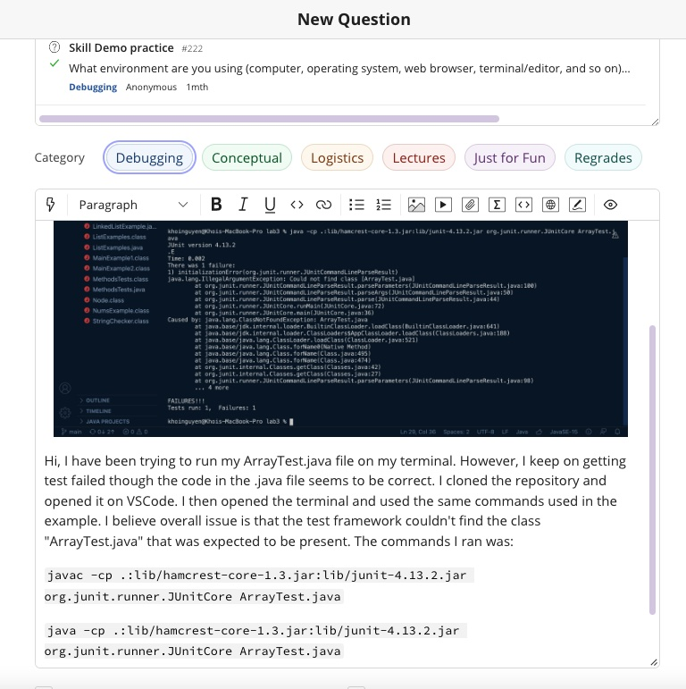
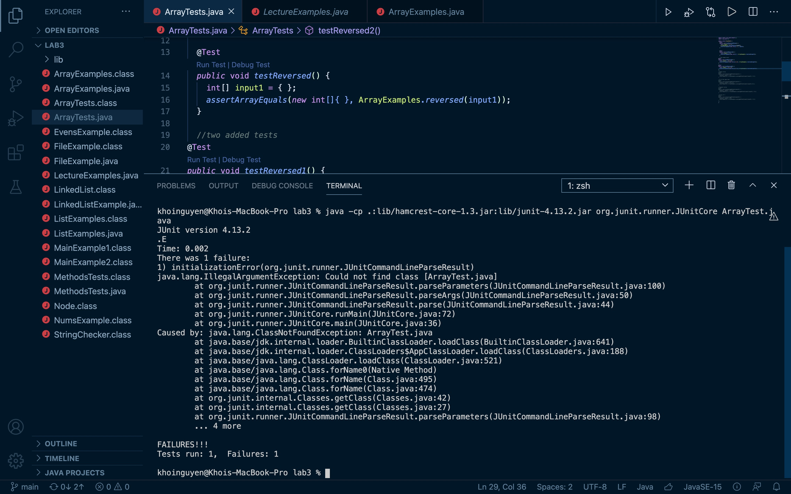

# Lab 5
## Khoi Nguyen
**Introduction**  
In this lab, I will design a debugging scenario in the spirit and style of the scenario in class. My report will be written as a conversation on EdStem.  

**The Post**  
  
Here is a closer look at the screenshot provided:  
  

**TA Response**  
When running a JUnit test, you should not include the .java extension in the class name because JUnit expects the class name itself, without the file extension.  
In the error message you provided, the problematic line is:  

`java.lang.IllegalArgumentException: Could not find class [ArrayTests.java]`

This error occurred because JUnit was trying to load the class "ArrayTests.java" with the .java extension, which is not the correct way to refer to a class. JUnit expects the class name without the file extension. To resolve this issue, you should run the JUnit test by specifying only the class name without the .java extension. For example, if your test class is named ArraysTest, you should run it as ArraysTest, not ArrayTests.java.  
In summary, first you should clone the [lab3 repository](https://github.com/ucsd-cse15l-w23/lab3) (<- link is embedded here). Next make sure you are in the lab 3 directory. Lastly, revisit the [week 3 notes](https://ucsd-cse15l-s23.github.io/week/week3/) on the course website (<- link is embedded here as well). Since JUnit is an external library, it requires some extra work to compile and run. These two commands work well, and you should see output like the below when you run them:  
MAC USERS:  
`local $ javac -cp .:lib/hamcrest-core-1.3.jar:lib/junit-4.13.2.jar *.java
local $ java -cp .:lib/hamcrest-core-1.3.jar:lib/junit-4.13.2.jar org.junit.runner.JUnitCore ArrayTests`
 
WINDOW USERS:  
`local $ javac -cp ".;lib/hamcrest-core-1.3.jar;lib/junit-4.13.2.jar" *.java
local $ java -cp ".;lib/junit-4.13.2.jar;lib/hamcrest-core-1.3.jar" org.junit.runner.JUnitCore ArrayTests`
 
Good luck!
 

**Reflection**
I have learned an ample of information in the second half of this quarter. To start, I learned that Vim is a highly configurable, text-based text editor for Unix-like operating systems. I also learned how to use Vim and essential commands and modes such as `x` to delete character, `i` to insert mode, `:wq!` to save changes to the file and exit Vim. I also learned how to push and commit changes to my Github account. Not to mention, I learned the interworkings of Gradescope by coding an autograder and better improved my understanding of Linux.
